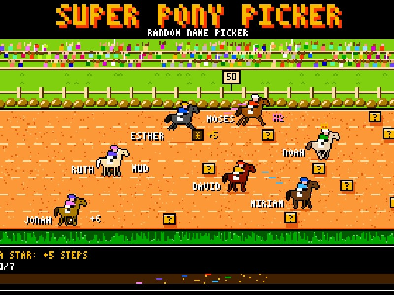

  
  
  

I design the platforms that let AI assistants work **safely and reliably** with the systems and data people depend on: **Model Context Protocol (MCP)** servers, multi-agent orchestration, retrieval-augmented generation and AI-driven QA. Licensed professional engineer, based in Bogotá, Colombia. *Your friendly neighborhood software engineer.*

## What I Build

- **AI platforms.** I designed and built, and now lead, an AI platform based on MCP: one core for identity, permissions, credentials and observability, where integrations are switched on or off through configuration and every change to real data is previewed and confirmed by a person before it runs.
- **AI quality and security.** Adversarial, LLM-generated test cases that try to break a system before anyone else does.
- **Applied AI.** RAG pipelines, tool-calling agents and benchmarks of open-source models running locally.
- **Data engineering.** ETL pipelines and BI dashboards that turn hours of manual analysis into minutes.

## Featured Projects

<table>
<tr>
<td width="50%" valign="top">

<b><a href="https://montenegrodanielfelipe.com/projects/gabo-rag/">Gabo RAG</a></b> · <a href="https://github.com/dafmontenegro/gabo-rag">repo</a> 
A RAG assistant over Gabriel García Márquez’s work, with Nomic embeddings in a persistent Chroma store, compared across DeepSeek-R1, Llama 3.2 and Phi-3.5. 
Python · LangChain · Ollama · ChromaDB

</td>
<td width="50%" valign="top">

<b><a href="https://montenegrodanielfelipe.com/projects/ecommerce-conversational-agent/">E-Commerce Agent</a></b> 
A tool-calling agent with seven tools and a RAG-powered FAQ, benchmarked on Qwen3 4B, Llama 3.2 3B and Phi-4-mini for accuracy, multi-intent handling and latency. 
Python · LangChain · Ollama · ChromaDB

</td>
</tr>
<tr>
<td width="50%" valign="top">

<b><a href="https://montenegrodanielfelipe.com/projects/prisoners-dilemma-dynamic-networks/">Prisoner’s Dilemma in Dynamic Networks</a></b> 
My undergraduate thesis, advised by Juan David García Arteaga: an agent-based framework to study when cooperation survives on networks that rewire themselves. 
Python · NetworkX · NumPy · Matplotlib

</td>
<td width="50%" valign="top">

<b><a href="https://montenegrodanielfelipe.com/projects/pi-tensorflow-lite-object-detection/">Real-Time Object Detection</a></b> · <a href="https://github.com/dafmontenegro/pi-tensorflow-lite-object-detection">repo</a> 
Live video on a Raspberry Pi with a TensorFlow Lite model, threaded processing, GPIO alerts, event recording and a local monitoring server. 
Python · TensorFlow Lite · OpenCV · Flask

</td>
</tr>
<tr>
<td width="50%" valign="top">

<b><a href="https://montenegrodanielfelipe.com/projects/super-pony-picker/">Super Pony Picker</a></b> 
A random name picker run as an 8-bit pony race, with draws from the browser’s cryptographic random generator and sound synthesized live. 
JavaScript · p5.js · Web Crypto · Web Audio

</td>
<td width="50%" valign="top">

<b><a href="https://montenegrodanielfelipe.com/projects/raspberry-pi-101-unal/">Raspberry Pi 101</a></b> 
A hands-on course on single board computers for the Digital Technology course at the Universidad Nacional de Colombia. 
Raspberry Pi · SSH · GPIO · OpenCV · Flask

</td>
</tr>
</table>

More on GitHub: [prisoners-dilemma-cellular-automata](https://github.com/dafmontenegro/prisoners-dilemma-cellular-automata) · [sine-wave-based-digital-keyboard](https://github.com/dafmontenegro/sine-wave-based-digital-keyboard) · [img2prompt](https://github.com/dafmontenegro/img2prompt) · [neural-trend-hub](https://github.com/dafmontenegro/neural-trend-hub)

## Art and AI

Together with Juan David García Arteaga, I collaborated on two artworks by the artist [**Mónica Páez**](https://monicapaez.com/) that question how AI describes, translates and reimagines the spaces around us.

<table>
<tr>
<td width="50%" valign="top">

<b><a href="https://montenegrodanielfelipe.com/projects/la-traicion-necesaria/"><i>La traición necesaria</i></a></b> 
An AI describes the exhibition space and recreates it from its own words, again and again. 
Exhibition hall, Universidad de los Andes · March 2026

</td>
<td width="50%" valign="top">

<b><a href="https://montenegrodanielfelipe.com/projects/visiones-inestables/"><i>Visiones inestables</i></a></b> 
Language models imagine unstable futures of a museum from its photographs and the texts that define it. 
Art Museum, Universidad Nacional de Colombia · June 2026

</td>
</tr>
</table>

## Toolbox

        
       
     

## Writing

Technical notes, such as [running Ollama on Google Colab](https://montenegrodanielfelipe.com/blog/run-ollama-colab/), and essays on cinema and literature: [*Memories of Murder*](https://montenegrodanielfelipe.com/blog/memories-of-murder/), [*Se7en*](https://montenegrodanielfelipe.com/blog/se7en-the-death-of-mills/), [*Zima Blue*](https://montenegrodanielfelipe.com/blog/zima-blue/), [*Daredevil: Born Again*](https://montenegrodanielfelipe.com/blog/daredevil-born-again-illusion-of-control/) and [*Le Comte de Monte-Cristo*](https://montenegrodanielfelipe.com/blog/le-comte-de-monte-cristo-attendre-et-esperer/). All of it on [the blog](https://montenegrodanielfelipe.com/blog/).

---

The symbol above is <a href="https://montenegrodanielfelipe.com/about/#caesars-window">Caesar's Window</a>: sometimes it seems we can go faster alone, but together we can always go further.
